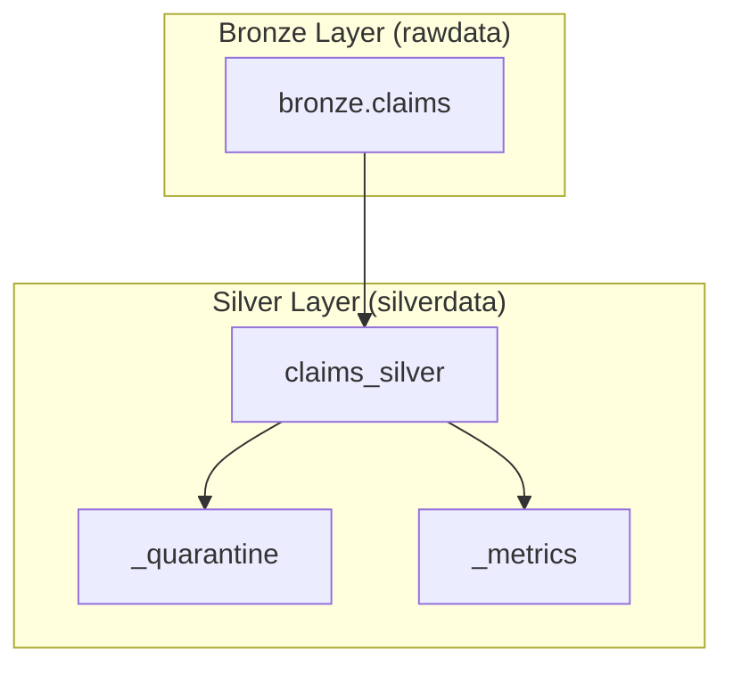

# Claims Silver Layer – Enterprise Architecture & Business Report

## Table of Contents
1. [Context & Purpose](#context--purpose)  
2. [Bronze vs Silver Claims](#bronze-vs-silver-claims)  
3. [Claims Silver Pipeline – Detailed Steps](#claims-silver-pipeline--detailed-steps)  
4. [New Silver Features](#new-silver-features)  
5. [Foreign Key Behaviour](#foreign-key-behaviour)  
6. [Quarantine & DQ Strategy](#quarantine--dq-strategy)  
7. [Architecture Diagram](#architecture-diagram)  
8. [Interview-Ready Explanation](#interview-ready-explanation)  
9. [Slide-Style Summary](#slide-style-summary)  

---

## Context & Purpose

The Claims Silver layer converts raw, inconsistent claim records from Kaggle’s Medicare Fraud dataset into a **clean, validated, business-ready Delta table** suitable for analytics, fraud insights, and operational KPIs.

Silver Claims applies enterprise standards:

- schema enforcement  
- primary key validation  
- provider FK integrity  
- date consistency rules  
- financial sanity checks  
- new KPIs  
- deduplication  
- quarantine of bad data  
- metrics logging for observability  

---

## Bronze vs Silver Claims

### Bronze (rawdata.claims) issues:
- 7% missing Provider_ID  
- Member_Key does not match Members dimension (100%)  
- Date_Reported and Date_Settled mostly NULL  
- No SLA or settlement metric  
- No data quality signals  
- No FK integrity  

### Silver fixes:
| Area | Bronze | Silver |
|------|--------|--------|
| Schema | raw CSV types | Enforced enterprise schema |
| PK | present | validated |
| Provider FK | missing/inconsistent | validated + quarantined |
| Member FK | incompatible across datasets | treated as soft FK |
| Dates | often null | validated + dq_date_valid |
| Money fields | present but unchecked | dq_money_valid applied |
| KPIs | none | Days_To_Settle |
| DQ | none | dq flags + quarantines |
| Metrics | none | rowcount + distinct count |

---

## Claims Silver Pipeline – Detailed Steps

### **1. Read & Enforce Schema**
Cast all columns into expected enterprise schema:

```text
Claim_ID, Provider_ID, Member_Key, Date_Reported, Date_Settled,
Payout_GBP, Claim_Amount_GBP, Fraud_Label, Claim_Type, Claim_Status
```

### **2. PK Validation**
`Claim_ID` must exist — otherwise quarantined.

### **3. FK Checks**
#### Provider_ID (strong FK)
- 7% missing/mismatched → quarantined  
- These remain in Silver as valid rows with warning flags

#### Member_Key (soft FK)
- Comes from different Kaggle source  
- Not enforceable → logged but not quarantined  
- Mirrors real legacy system mismatches

### **4. Date Validations**
- Dates can be null  
- If present, date order must be logical  
- Flagged via `dq_date_valid`  

### **5. Monetary Validations**
- Flag negative payouts / claim amounts  
- `dq_money_valid` produced (0/1)

### **6. Deduplication**
- Latest record wins (using Claim_ID)

### **7. New KPI Creation**
`Days_To_Settle = datediff(Date_Settled, Date_Reported)`
→ NULL if dates missing

### **8. DQ Flags**
- `dq_money_valid`
- `dq_date_valid`

### **9. Quarantine**
Stored at:

```
silverdata/_quarantine/claims/<violation_type>
```

### **10. Metrics Logging**
Stored at:

```
silverdata/_metrics
```

Metrics include:

- rowcount_claims_silver  
- distinct_claim_ids  
- FK violation counts  

---

## New Silver Features

| Feature | Meaning | Business Value |
|---------|---------|----------------|
| **Days_To_Settle** | Days between report & settlement | SLA monitoring, customer experience, operations |
| **dq_money_valid** | Flags negative or invalid amounts | Protects BI & ML from corrupted values |
| **dq_date_valid** | Flags reversed or invalid dates | Ensures lifecycle metrics are correct |

---

## Foreign Key Behaviour

### `Provider_ID`
- Validated strictly  
- 7% missing/mismatch quarantined  
- Shows real-world data quality debt

### `Member_Key`
- Not enforceable because:
  - Claims from Medicare dataset use `BENExxxxx`
  - Members from synthetic cross-sell dataset use `MEM_xxxxxx`
- Mismatch is expected and documented  
- Treated as **transactional ID**, not dimension FK  

---

## Quarantine & DQ Strategy

Claims Silver uses **quarantine-first governance**:

- No bad data is silently dropped  
- Every invalid row is captured with:
  - violation code  
  - timestamp  
  - full JSON payload  

This forms a fully auditable trail for data stewards and compliance.

---

## Architecture Diagram



---

## Interview-Ready Explanation

> “The Claims Silver layer transforms inconsistent raw claims into a trusted corporate dataset. We validate provider references, correct date issues, add SLA metrics like Days_To_Settle, generate data-quality flags, and surface all problems through a quarantine zone instead of hiding them. Member_Key mismatches are intentionally treated as soft FKs due to the combination of independent Kaggle sources. The result is a clean, governed dataset ready for operational dashboards, fraud analytics, and ML use cases — exactly how real insurers manage data quality.”

---

## Slide-Style Summary

### Slide A – Why Silver?
- Bronze claims contain missing providers, mismatched members, incomplete dates  
- Silver makes claims usable for business reporting  

### Slide B – Key Transformations
- Schema enforcement  
- PK checks  
- FK checks  
- Date & money validation  
- Deduplication  
- KPI derivation  

### Slide C – New Features
- Days_To_Settle  
- dq_money_valid  
- dq_date_valid  

### Slide D – Quarantine
- Missing provider IDs  
- Provider mismatches  
- Logged member mismatches  

### Slide E – Final Output
- 558,211 Silver claims  
- Complete lineage  
- Trustworthy KPIs  
- BI- and ML-ready Delta table  

