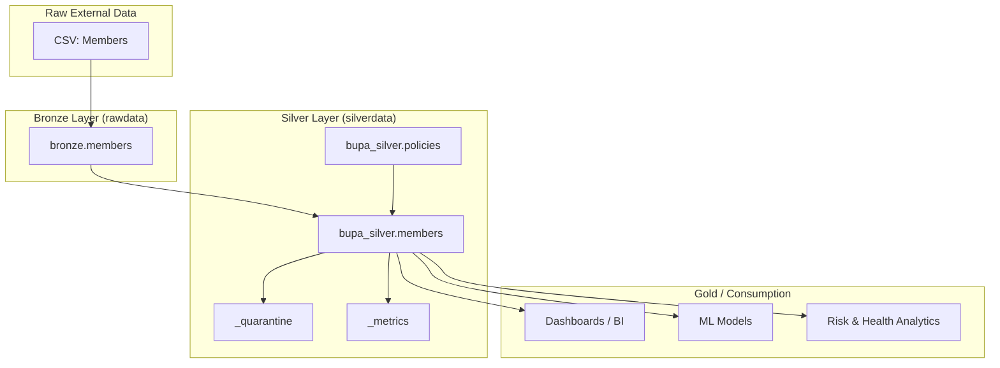

# Enterprise Members Silver Layer – Architecture & Business Report

## Table of Contents

1. [Context & Objective](#1-context--objective)  
2. [Layered Architecture Overview](#2-layered-architecture-overview)  
   - [High-Level Data Flow](#21-high-level-data-flow)  
   - [Members-Specific Flow](#22-members-specific-flow)  
3. [Bronze vs Silver – What Changes?](#3-bronze-vs-silver--what-changes)  
   - [Columns Comparison](#31-columns-comparison)  
   - [New Silver Features & Business Purpose](#32-new-silver-features--business-purpose)  
4. [Members Silver Pipeline – Step-by-Step](#4-members-silver-pipeline--step-by-step)  
   - [Step 1: Read & Enforce Schema](#41-step-1-read--enforce-schema)  
   - [Step 2: Key & Foreign-Key Integrity Checks](#42-step-2-key--foreign-key-integrity-checks)  
   - [Step 3: Age & BMI Validations](#43-step-3-age--bmi-validations)  
   - [Step 4: Normalisation of Categorical Fields](#44-step-4-normalisation-of-categorical-fields)  
   - [Step 5: Deduplication](#45-step-5-deduplication)  
   - [Step 6: Feature Engineering & DQ Flags](#46-step-6-feature-engineering--dq-flags)  
   - [Step 7: Writing Silver Members](#47-step-7-writing-silver-members)  
   - [Step 8: Metrics & Observability](#48-step-8-metrics--observability)  
   - [Step 9: Comparison & Validation](#49-step-9-comparison--validation)  
5. [Architecture Diagram – Visual View](#5-architecture-diagram--visual-view)  
6. [How to Explain This in an Interview](#6-how-to-explain-this-in-an-interview)  
7. [Slide-Style Summary (for Presentations)](#7-slide-style-summary-for-presentations)  

---

## 1. Context & Objective

This project simulates an **enterprise insurance data platform** with core entities:

- **Policies**
- **Members**
- **Claims**
- **Providers**

This report focuses on the **Members Silver layer**.

- **Bronze Members**: Raw ingested Delta tables from Kaggle-derived CSVs (no cleaning).  
- **Silver Members**: Business-ready, cleaned, validated & feature-enriched tables used by analytics, dashboards, and models.

**Goal:**  
Turn **raw member-level data** into a **trusted Members Silver dataset** that:

- has a **consistent schema**
- enforces **business and data quality rules**
- is safely **joinable with Silver Policies**
- supports **segmentation and risk analytics**

---

## 2. Layered Architecture Overview

### 2.1 High-Level Data Flow

```mermaid
flowchart LR
    subgraph Source["External Source (Kaggle / CSV)"]
        A[Raw CSV Files<br/>Policies, Claims, Members, Providers]
    end

    subgraph Bronze["Bronze Layer (Raw Delta)"]
        B1[bronze.policies]
        B2[bronze.members]
        B3[bronze.claims]
        B4[bronze.providers]
    end

    subgraph Silver["Silver Layer (Curated Delta)"]
        S1[policies_silver]
        S2[members_silver]
        S3[claims_silver]
        S4[providers_silver]
        SQ[_quarantine]
        SM[_metrics]
    end

    A --> B1
    A --> B2
    A --> B3
    A --> B4

    B1 --> S1
    B2 --> S2
    B3 --> S3
    B4 --> S4

    S1 --> S2
    S2 --> SM
    S2 --> SQ
````

**Key ideas:**

* Bronze = “**just landed**” Delta tables, very close to original CSVs.
* Silver = “**governed & trusted**” tables with validation, standardisation, and features.
* Members Silver depends on **Policies Silver** for foreign-key integrity.

---

### 2.2 Members-Specific Flow

```mermaid
flowchart TD
    BZ[bronze.members (Delta)]
    PZ[bupa_silver.policies]
    S1[Read & Enforce Schema]
    S2[Key & FK Checks<br/>(Member_ID, Policy_ID)]
    S3[Age & BMI Validations]
    S4[Normalize Categorical Fields]
    S5[Deduplicate Members]
    S6[Feature Engineering & DQ Flags]
    S7[Write Silver Members<br/>bupa_silver.members]
    Q[_quarantine]
    M[_metrics]

    BZ --> S1 --> S2 --> S3 --> S4 --> S5 --> S6 --> S7
    PZ --> S2
    S2 --> Q
    S3 --> Q
    S4 --> Q
    S7 --> M
```

---

## 3. Bronze vs Silver – What Changes?

### 3.1 Columns Comparison

In **Bronze Members**, the schema looks like:

* `Member_ID` (string)
* `Policy_ID` (string)
* `Age` (int)
* `Gender` (string, e.g. “Male”, “Female”, with inconsistencies)
* `BMI` (double)
* `Smoker` (string, often “Y/N” or “Yes/No”)
* `Chronic_Disease` (string)
* `Employment_Status` (string)
* `Region` (string / code)

In **Silver Members**, we keep all these core columns **but**:

* enforce consistent data types
* apply validations and normalisation
* optionally add new engineered fields such as:

  * `Age_Band`
  * `BMI_Category`
  * `dq_age_valid`
  * `dq_bmi_valid`
  * `dq_fk_policy_valid`

> The core information is preserved; the **quality and usability** are significantly improved.

---

### 3.2 New Silver Features – Business Purpose

| New Column           | Type      | Business Meaning                                                                     | Why It Matters                                                                                |
| -------------------- | --------- | ------------------------------------------------------------------------------------ | --------------------------------------------------------------------------------------------- |
| `Age_Band`           | string    | Groups the member’s age into ranges (e.g. 18–25, 26–35, etc.).                       | Makes segmentation and reporting much easier and more intelligible for non-technical users.   |
| `BMI_Category`       | string    | Categorises BMI into Underweight / Normal / Overweight / Obese.                      | Supports health and risk analytics without needing complex expressions in every model/report. |
| `dq_age_valid`       | int (0/1) | 1 if Age is within a plausible range (for example, 0–110), else 0.                   | Helps quickly filter out obviously incorrect ages in dashboards and models.                   |
| `dq_bmi_valid`       | int (0/1) | 1 if BMI is in a medically plausible range (e.g. 10–60), else 0.                     | Detects suspect BMI entries (typos, ingestion errors) that would otherwise skew analytics.    |
| `dq_fk_policy_valid` | int (0/1) | 1 if the member’s Policy_ID exists in Silver Policies, 0 if the member is an orphan. | Ensures member-level analytics and policy-level reporting are aligned and consistent.         |

These columns are **not present in the source**; they are introduced by the **Silver Members pipeline** to support enterprise-grade analytics and governance.

---

## 4. Members Silver Pipeline – Step-by-Step

### 4.1 Step 1: Read & Enforce Schema

* **Input:** `bronze.members` from `rawdata` container.
* We read the Bronze Delta table and cast to a well-defined schema:

```text
Member_ID          : string
Policy_ID          : string
Age                : int
Gender             : string
BMI                : double
Smoker             : string
Chronic_Disease    : string
Employment_Status  : string
Region             : string
```

This uses the **`enforce_schema`** utility so:

* all expected columns exist
* each column has a stable data type

**Business impact:**
Every consumer (SQL, BI, ML) sees **one consistent definition** of member attributes.

---

### 4.2 Step 2: Key & Foreign-Key Integrity Checks

We validate:

* `Member_ID` must not be null
* `Policy_ID` must not be null (for a usable analytical member)

We also ensure that:

* `Policy_ID` matches an existing record in **Silver Policies**.

Technical implementation can use:

* DQ helper (e.g. `dq_expect`) for basic null checks
* `fk_filter` or `dq_left_anti_ref` to compare against `bupa_silver.policies`

Records that fail:

* are **quarantined** into a `_quarantine` area with reason codes
* are excluded from the main Silver Members table

**Business impact:**

* Avoids “orphaned” members that don’t belong to any policy.
* Creates a clean **1-to-many** relationship between policies and members.

---

### 4.3 Step 3: Age & BMI Validations

We implement **plausibility checks** such as:

* Age in a reasonable range (e.g. 0–110)
* BMI in a realistic range (e.g. 10–60)

This logic can be expressed with:

* `dq_expect` to enforce hard or warning-level checks
* Derived flags `dq_age_valid` and `dq_bmi_valid`

Behaviour:

* Truly impossible values may be quarantined.
* Borderline values can be kept but flagged as dq=0 for transparency.

**Business impact:**

* Prevents analytic models from being distorted by invalid member characteristics.
* Makes it easy for dashboards to show “quality-adjusted population”.

---

### 4.4 Step 4: Normalisation of Categorical Fields

Using utilities like `normalize_categories`, we:

* Convert Gender to **M/F** where possible

* Convert Smoker to **Y/N** (normalising yes/no variants)

* Optionally map Employment_Status into a controlled set:

  * Employed
  * Self-Employed
  * Retired
  * Student

* Ensure Region codes are consistently formatted (e.g. stripping spaces, uppercasing)

**Business impact:**

* Eliminates fragmentation such as `male`, `Male`, `M`, `m` being treated as separate groups.
* Realigns reporting and modelling around consistent, governed dimensions.

---

### 4.5 Step 5: Deduplication

We ensure **one row per Member_ID** in Silver.

Typical approach:

* Use `drop_dupes_keep_latest(df, ["Member_ID"], [<ordering columns>])`
* The ordering column might be an ingestion timestamp or another recency field.

**Business impact:**

* Prevents double-counting members.
* Guarantees that reports reflect the **current profile** of each insured individual.

---

### 4.6 Step 6: Feature Engineering & DQ Flags

We then add Silver-only features such as:

* `Age_Band` (e.g. 0–17, 18–25, 26–35, 36–45, 46–60, 60+)
* `BMI_Category` (Underweight, Normal, Overweight, Obese)
* `dq_age_valid`, `dq_bmi_valid`, `dq_fk_policy_valid` flags

This step turns the cleaned data into a **business-analyst-friendly layer**.

**Business impact:**

* Makes it easy to answer questions like “Which age band has the highest claims ratio?”
* Provides **explicit flags** so analysts can choose whether to include suspect records.

---

### 4.7 Step 7: Writing Silver Members

We persist Silver Members to:

* **Delta path:**
  `abfss://silverdata@clientdatastorage.dfs.core.windows.net/members`

* **Hive-style table:**
  `bupa_silver.members`

We use a schema-aware overwrite mode so:

* table definition stays in sync with the Silver schema
* it’s easily queryable from notebooks, SQL clients, and BI tools

---

### 4.8 Step 8: Metrics & Observability

We use `write_metric` to log pipeline-level metrics to:

* `paths_silver["_metrics"]` (a Delta location)

Examples:

* `rowcount_members_silver`
* `distinct_member_ids`

Over time, this allows us to:

* track population growth or anomalies
* monitor pipeline health and detect breaking upstream changes

---

### 4.9 Step 9: Comparison & Validation

We compare **Bronze Members** vs **Silver Members** to validate:

* All intended columns are present
* Types are consistent where they should be
* New Silver-only features are documented:

  * Age_Band
  * BMI_Category
  * DQ flags

We can also run **reconciliation checks**, such as:

* “What percentage of Bronze members are successfully promoted into Silver?”
* “How many members are quarantined and why?”

---

## 5. Architecture Diagram – Visual View

### 5.1 Logical Architecture (Text Diagram)

```text
External CSVs (Kaggle)
        │
        ▼
+-----------------------------+
|   Bronze Layer              |
|  - rawdata.members (Delta)  |
+-----------------------------+
        │
        ▼
+----------------------------------------+
|   Silver Members                       |
|  - bupa_silver.members                 |
|                                        |
|  • Schema enforcement                  |
|  • Member_ID & Policy_ID validation    |
|  • Age & BMI plausibility checks       |
|  • Gender/Smoker normalisation         |
|  • FK validation to Silver Policies    |
|  • Deduplication                       |
|  • Age_Band & BMI_Category             |
|  • DQ flags (age, BMI, FK)             |
+----------------------------------------+
        │           │
        │           ├──> silverdata/_quarantine
        │           └──> silverdata/_metrics
        │
        ▼
      Gold / BI Layer
 (dashboards, ML, risk analytics)
```

### 5.2 Mermaid Architecture Diagram



---

## 6. How to Explain This in an Interview

### Short, Non-Technical Script

> “I implemented a Silver Members layer following an enterprise Lakehouse pattern. Raw member data from Kaggle is first landed into a Bronze area. From there, I created a Silver Members pipeline that enforces schema, validates member and policy IDs, checks whether Age and BMI are realistic, normalises categorical fields like Gender and Smoker, and ensures every member is correctly linked to a policy in Silver Policies. I also introduce age bands, BMI categories, and data quality flags so business users and data scientists can filter to ‘trusted’ members. Violations are quarantined instead of silently dropped, and I log metrics like row counts and distinct members for observability. This results in a clean, policy-aware member dataset that is ready for dashboards, risk analysis, and machine learning.”

---

## 7. Slide-Style Summary (for Presentations)

You can convert this straight into slides:

### Slide A – Why Members Silver?

* Raw member data is messy and sometimes inconsistent
* Silver Members provides a **trusted, policy-linked view** of every insured person
* Reduces risk of wrong conclusions due to bad Age/BMI or broken foreign keys

### Slide B – What Changes from Bronze to Silver?

* Core fields kept: Member_ID, Policy_ID, Age, Gender, BMI, Smoker, etc.
* Added: Age_Band, BMI_Category, DQ flags (age, BMI, FK)
* Keys and foreign keys are validated; invalid rows quarantined

### Slide C – Business Impact of New Fields

* **Age_Band** enables simple segmentation in dashboards
* **BMI_Category** supports health and risk insights
* **DQ flags** give transparency about quality and allow safe filtering

### Slide D – Controls & Governance

* Quarantine areas capture bad records with reasons
* Metrics log each run’s volumes and quality
* FK validation ensures Members and Policies views are aligned

### Slide E – Final Outcome

* A **clean, consistent Members dataset** that is:

  * Joinable with Policies
  * Ready for analytics and ML
  * Governed and auditable
* Mirrors patterns used in real enterprise insurance platforms

---

*End of `members_silver_report.md`*
