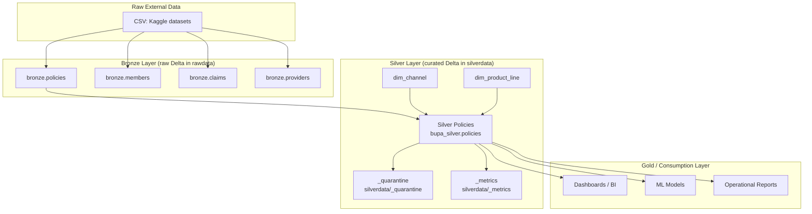

# Enterprise Policies Silver Layer – Architecture & Business Report

## Table of Contents

1. [Context & Objective](#1-context--objective)  
2. [Layered Architecture Overview](#2-layered-architecture-overview)  
   - [High-Level Data Flow](#21-high-level-data-flow)  
   - [Policies-Specific Flow](#22-policies-specific-flow)  
3. [Bronze vs Silver – What Changes?](#3-bronze-vs-silver--what-changes)  
   - [Columns Comparison](#31-columns-comparison)  
   - [New Silver Features](#32-new-silver-features--business-purpose)  
4. [Policies Silver Pipeline – Step-by-Step](#4-policies-silver-pipeline--step-by-step)  
   - [Step 1: Read & Enforce Schema](#41-step-1-read--enforce-schema)  
   - [Step 2: Key Integrity Checks](#42-step-2-key-integrity-checks)  
   - [Step 3: Date & Monetary Validations](#43-step-3-date--monetary-validations)  
   - [Step 4: Deduplication & Normalisation](#44-step-4-deduplication--normalisation)  
   - [Step 5: Data Quality Flags](#45-step-5-data-quality-flags)  
   - [Step 6: Reference Dimensions](#46-step-6-reference-dimensions)  
   - [Step 7: DQ Expectations & SLA Logic](#47-step-7-dq-expectations--sla-logic)  
   - [Step 8: Writing Silver Policies](#48-step-8-writing-silver-policies)  
   - [Step 9: Metrics & Observability](#49-step-9-metrics--observability)  
   - [Step 10: Comparison & Validation](#410-step-10-comparison--validation)  
5. [Architecture Diagram – Visual View](#5-architecture-diagram--visual-view)  
6. [How to Explain This in an Interview](#6-how-to-explain-this-in-an-interview)  
7. [Slide-Style Summary (for Presentations)](#7-slide-style-summary-for-presentations)  

---

## 1. Context & Objective

This project simulates an **enterprise insurance data platform** where we manage:

- **Policies**
- **Members**
- **Claims**
- **Providers**

The focus of this report is the **Policies Silver layer**.

- **Bronze**: raw ingested Delta tables from Kaggle CSVs (no cleaning).
- **Silver**: business-ready, cleaned, validated & feature-enriched tables used by analytics, dashboards and models.

**Goal:**  
Turn **messy raw policy data** into a **trusted Policies Silver dataset** that:

- has **consistent schema**
- enforces **business rules**
- includes **data quality indicators**
- is safe for **reporting and modelling**

---

## 2. Layered Architecture Overview

### 2.1 High-Level Data Flow

```mermaid
flowchart LR
    subgraph Source["External Source (Kaggle / CSV)"]
        A[Raw CSV Files<br/>Policies, Claims, Members, Providers]
    end

    subgraph Bronze["Bronze Layer (Raw Delta)"]
        B1[bronze.policies]
        B2[bronze.members]
        B3[bronze.claims]
        B4[bronze.providers]
    end

    subgraph Silver["Silver Layer (Curated Delta)"]
        S1[policies_silver]
        S2[members_silver]
        S3[claims_silver]
        S4[providers_silver]
        SQ[_quarantine]
        SM[_metrics]
        SR[(reference dimensions)]
    end

    A --> B1
    A --> B2
    A --> B3
    A --> B4

    B1 --> S1
    B2 --> S2
    B3 --> S3
    B4 --> S4

    S1 --> SM
    S1 --> SQ
    SR --> S1
````

**Key ideas:**

* Bronze = “**just landed**” copies of Kaggle data.
* Silver = “**governed & trusted**” data with validations.
* Quarantine = **where bad records go** instead of being silently dropped.
* Metrics = **small fact table of pipeline health**.

---

### 2.2 Policies-Specific Flow

```mermaid
flowchart TD
    BZ[bronze.policies (Delta)]
    S1[Read & Enforce Schema]
    S2[Key Checks<br/>(Policy_ID, Customer_ID)]
    S3[Date & Money Validations]
    S4[Deduplicate<br/>Latest per Policy_ID]
    S5[Feature Engineering<br/>+ DQ Flags]
    S6[Reference Checks<br/>Channel & Product]
    S7[Write Silver Table<br/>bupa_silver.policies]
    Q[_quarantine paths_silver['_quarantine']]
    M[_metrics paths_silver['_metrics']]

    BZ --> S1 --> S2 --> S3 --> S4 --> S5 --> S6 --> S7
    S2 --> Q
    S3 --> Q
    S5 --> Q
    S6 --> Q
    S7 --> M
```

---

## 3. Bronze vs Silver – What Changes?

### 3.1 Columns Comparison

From the comparison code, we saw:

* **New columns in Silver**:
  `['Policy_Duration_Days', 'Renewal_Conversion', 'dq_discount_valid', 'dq_money_valid', 'dq_renewal_valid']`
* **Dropped columns**:
  `[]` – nothing was dropped
* **Common columns (unchanged logically and in data type)**:

  * `Policy_ID` (string)
  * `Customer_ID` (string)
  * `Product_Line` (string)
  * `Sum_Insured_GBP` (double)
  * `Annual_Premium_GBP` (double)
  * `Policy_Start_Date` (date)
  * `Policy_End_Date` (date)
  * `Renewal_Offered_Flag` (int)
  * `Renewal_Accepted_Flag` (int)
  * `Discount_Offered_%` (double)
  * `Channel` (string)

**Important:**
The **core business fields are preserved**; Silver does not change their meaning, it only:

* enforces types
* validates values
* adds extra columns to help interpretation and quality monitoring.

---

### 3.2 New Silver Features – Business Purpose

| New Column             | Type     | Business Meaning                                                                            | Why It Matters                                                                                |
| ---------------------- | -------- | ------------------------------------------------------------------------------------------- | --------------------------------------------------------------------------------------------- |
| `Policy_Duration_Days` | int      | Number of days between `Policy_Start_Date` and `Policy_End_Date`.                           | Used for tenure KPIs, churn windows, duration-based pricing, and exposure calculations.       |
| `Renewal_Conversion`   | int      | Keeps the `Renewal_Accepted_Flag` **only when** renewal was actually offered (Offered = 1). | Produces a *clean* renewal metric: avoids over-counting when acceptance is inconsistent.      |
| `dq_discount_valid`    | int(0/1) | 1 if `Discount_Offered_%` is between 0 and 100 (or null), otherwise 0.                      | Flags incorrect input; protects dashboards and models from nonsense discount values.          |
| `dq_money_valid`       | int(0/1) | 1 if all monetary fields (Sum insured, premium) are non-negative.                           | Identifies financially impossible records early for investigation.                            |
| `dq_renewal_valid`     | int(0/1) | 1 when renewal acceptance logically implies renewal was offered.                            | Highlights logical inconsistencies in renewal states, so stakeholders don’t trust wrong KPIs. |

These features **do not exist in the source data** – they are **added by the Silver pipeline** to give business users more reliable insight and data quality transparency.

---

## 4. Policies Silver Pipeline – Step-by-Step

### 4.1 Step 1: Read & Enforce Schema

* **Input:** `bronze.policies` from container `rawdata`.
* We read the Bronze Delta table and cast columns to a **well-defined schema**:

  ```text
  Policy_ID             : string
  Customer_ID           : string
  Product_Line          : string
  Sum_Insured_GBP       : double
  Annual_Premium_GBP    : double
  Policy_Start_Date     : date
  Policy_End_Date       : date
  Renewal_Offered_Flag  : int
  Renewal_Accepted_Flag : int
  Discount_Offered_%    : double
  Channel               : string
  ```

**Business impact:**
Every analyst, report, or model sees the **same consistent shape** of policy data, removing ambiguity.

---

### 4.2 Step 2: Key Integrity Checks

We perform **hard checks** on:

* `Policy_ID` must not be null
* `Customer_ID` must not be null

Records that fail these conditions are:

* **sent to quarantine**
* **excluded from Silver**

This is done using DQ helpers like:

* `dq_expect`
* `quarantine`

**Business impact:**
A policy without a Policy ID or Customer ID is **not usable** in customer, revenue, or profitability analysis. Instead of silently dropping them, we **quarantine** them so data stewards can investigate.

---

### 4.3 Step 3: Date & Monetary Validations

**Date rules:**

* `Policy_End_Date` should be **after or equal to** `Policy_Start_Date`.
* If dates are reversed, we apply a **safe swap** to fix them via `fix_dates` utility.

**Money rules:**

* `Annual_Premium_GBP >= 0`
* `Sum_Insured_GBP >= 0`

When values violate expectations:

* They are flagged using data quality columns like `dq_money_valid`.
* Severe cases can be quarantined depending on DQ severity.

**Business impact:**
We avoid impossible contract periods and negative financial figures, which would break KPIs and regulatory reporting.

---

### 4.4 Step 4: Deduplication & Normalisation

We may have multiple rows per `Policy_ID` (e.g., multiple snapshots).

We use:

* `drop_dupes_keep_latest(df, ["Policy_ID"], ["Policy_Start_Date"])`

to ensure:

* **One row per Policy_ID**
* The **latest version** wins based on start date.

**Business impact:**
Executives and analysts always see the **current view of each policy**, without double-counting or confusion.

---

### 4.5 Step 5: Data Quality Flags

We enrich the dataset with **soft DQ flags**:

* `dq_money_valid`: non-negative financial fields
* `dq_discount_valid`: discount between 0 and 100 (or null)
* `dq_renewal_valid`: accepted renewal implies offered renewal

These are calculated as standard 0/1 flags. They **do not exclude rows**, but allow:

* filtering in dashboards (e.g., “only dq_valid rows”)
* monitoring data quality trends

**Business impact:**
Business users know **how clean** the data is and can choose whether to include/exclude suspicious records.

---

### 4.6 Step 6: Reference Dimensions

We create and maintain reference dimensions in **Silver**:

* `dim_channel` (Agent, Broker, Online, Partner)
* `dim_product_line` (Accident, Dental, Health, Motor, Travel)

Using `dq_left_anti_ref`, we validate that:

* `Channel` exists in `dim_channel`
* `Product_Line` exists in `dim_product_line`

Any mismatches can be:

* quarantined, or
* reported for investigation.

**Business impact:**
Avoids category fragmentation like `online / OnLine / Online` that ruins aggregated reporting.

---

### 4.7 Step 7: DQ Expectations & SLA Logic

We define **expectations** using `dq_expect`, for example:

* Keys not null
* Dates in valid order
* Monetary values >= 0
* Discounts in valid range

If a rule fails:

* We quarantine violating rows.
* For some rules, we may fail the pipeline if the violation rate exceeds an agreed SLA.

**Business impact:**
We have **explicit, documented data contracts** between upstream systems and downstream analytics.

---

### 4.8 Step 8: Writing Silver Policies

We write the **final curated policies** to:

* **Delta path:**
  `abfss://silverdata@clientdatastorage.dfs.core.windows.net/policies`
* **Hive-style table:**
  `bupa_silver.policies`

We use a **schema-aware overwrite** so:

* the table always matches the Silver schema
* it is ready for SQL access and BI tools

---

### 4.9 Step 9: Metrics & Observability

Using `write_metric`, we log metrics like:

* `rowcount_policies_silver`
* `distinct_policy_ids`

to a Delta location:

* `paths_silver["_metrics"]`

**Business impact:**

* Track how many policies are processed each run.
* Detect sudden drops/spikes.
* Show data quality trends over time.

---

### 4.10 Step 10: Comparison & Validation

We explicitly compare:

* **bronze.policies** vs **bupa_silver.policies**

We report:

* new features
* unchanged features
* dropped features (if any)
* for each common feature: type consistency and number of changed values

**Business-friendly explanation:**
We can clearly say:

> “We did not change your core policy fields; we only added more intelligence and quality flags on top.”

---

## 5. Architecture Diagram – Visual View

### 5.1 Logical Architecture (Text Diagram)

```text
External CSVs (Kaggle)
        │
        ▼
+-------------------------+
|   Bronze Layer          |
|  - rawdata.policies     |
|  - rawdata.members      |
|  - rawdata.claims       |
|  - rawdata.providers    |
+-------------------------+
        │
        ▼   (Policies pipeline)
+-------------------------+
|   Silver Policies       |
|  - bupa_silver.policies |
|                         |
|  • Schema enforcement   |
|  • Key validation       |
|  • Date fixes           |
|  • Money checks         |
|  • Renewal logic        |
|  • Deduplication        |
|  • New features (KPI/DQ)|
+-------------------------+
        │        │
        │        ├──> _quarantine (bad records)
        │        └──> _metrics (run metrics)
        │
        ▼
   Gold / BI Layer
  (Dashboards, ML, Reporting)
```

### 5.2 Mermaid Architecture Diagram



---

## 6. How to Explain This in an Interview

### Short, Non-Technical Script

> “I built an enterprise-style data pipeline for insurance policies using a layered architecture.
> Raw Kaggle data is ingested into a Bronze layer as-is.
> From there, I created a Silver Policies layer where I enforce schema, validate critical business rules (like valid dates, financial sanity, and renewal logic), deduplicate policies, and add new business-friendly features like policy duration and clean renewal conversion.
> I also implemented quarantine and metrics logging so data quality issues are never hidden—they’re traceable and measurable.
> The result is a trusted Policies dataset that business teams can safely use for reporting, dashboards, and pricing or retention analysis.”

---

## 7. Slide-Style Summary (for Presentations)

You can convert this section directly into slides.

### Slide A – Why Silver?

* Raw data is often messy and inconsistent.
* Silver creates **trusted, governed, analysis-ready** data.
* Reduces risk of wrong decisions from bad data.

### Slide B – What Changes from Bronze to Silver?

* Core fields preserved: `Policy_ID`, `Customer_ID`, `Premium`, Dates, etc.
* New columns added:

  * `Policy_Duration_Days`
  * `Renewal_Conversion`
  * `dq_money_valid`
  * `dq_discount_valid`
  * `dq_renewal_valid`

### Slide C – Business Impact of New Fields

* **Policy_Duration_Days** → tenure & churn analysis.
* **Renewal_Conversion** → accurate renewal KPIs.
* **DQ flags** → transparency and control over data quality.

### Slide D – Controls & Governance

* Quarantine for invalid records (never silently dropped).
* Metrics logged per run (row counts, distinct IDs).
* Reference dimensions keep categories consistent.

### Slide E – Final Outcome

* A **clean, auditable, and business-friendly** Policies dataset.
* Ready for dashboards, advanced analytics, and ML.
* Follows the same patterns used by large enterprises (Infosys/Bupa-type environments).

---

*End of `policies_silver_report.md`*

```
::contentReference[oaicite:0]{index=0}
```
