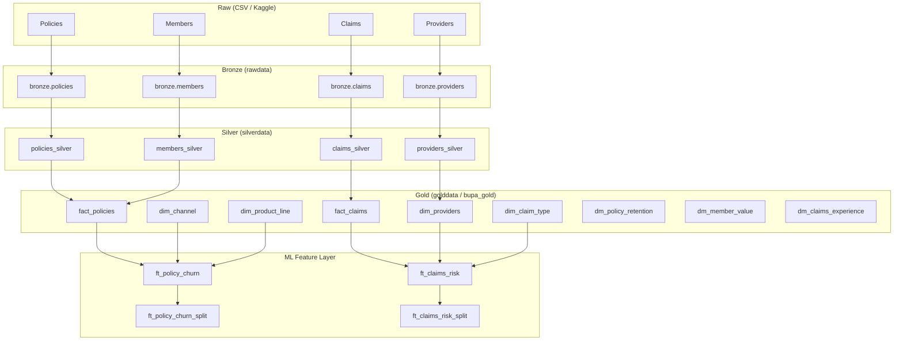

## 2) MARKDOWN VERSION (ready for `.md`)

````markdown
# Enterprise ML Feature Layer – Policy Churn & Claims Risk

## Table of Contents

1. [Context & Objectives](#1-context--objectives)  
2. [Business Problems & Targets](#2-business-problems--targets)  
3. [Upstream Data Sources](#3-upstream-data-sources)  
4. [Feature Table: `ft_policy_churn`](#4-feature-table-ft_policy_churn)  
5. [Feature Table: `ft_claims_risk`](#5-feature-table-ft_claims_risk)  
6. [Train/Test Split Tables](#6-traintest-split-tables)  
7. [Architecture Overview](#7-architecture-overview)  
8. [How to Explain This in an Interview](#8-how-to-explain-this-in-an-interview)  
9. [Slide-Style Summary](#9-slide-style-summary)  

---

## 1. Context & Objectives

On top of the **Gold layer**, we created **ML-ready feature tables** for two high-value insurance use-cases:

- **Policy churn / renewal prediction**
- **Claims fraud and high-cost risk scoring**

These tables are:

- **Curated**: built from DQ-checked Gold facts and dimensions  
- **Explainable**: business logic is transparent and documented  
- **Reusable**: designed once, reused across notebooks and ML platforms  
- **Governed**: stored in `goldata` container and `bupa_gold` schema

---

## 2. Business Problems & Targets

### 2.1 Policy Churn – `ft_policy_churn`

**Business question**

> *“Given what we know about a policy and its context, will the customer renew or churn?”*

**Target label: `Churn_Label`**

- `1` → Policy **churned** (customer did **not** renew)  
- `0` → Policy **renewed / retained**

Derived from the renewal flags in Gold:

- If `Renewal_Offered_Flag = 1` **and** `Renewal_Accepted_Flag = 1` → `Churn_Label = 0`  
- If `Renewal_Offered_Flag = 1` **and** `Renewal_Accepted_Flag = 0` → `Churn_Label = 1`  
- No renewal offer → typically labelled as `NULL` or excluded from churn modelling.

This matches real business logic: churn is only measured where there **was a chance to renew**.

---

### 2.2 Claims Risk – `ft_claims_risk`

**Business question**

> *“Which claims are likely to be fraudulent or unusually high cost?”*

**Targets**

- `Is_Fraudulent_Claim`
  - 1 = suspicious / fraudulent (from claim or provider fraud labels)  
  - 0 = not flagged as fraud
- `Is_High_Cost`
  - 1 = high-cost claim (based on high-cost flag)  
  - 0 = normal-cost claim

These targets support:

- SIU / fraud teams (prioritising investigations)  
- Claims operations (early warning on high-cost claims)

---

## 3. Upstream Data Sources

The ML features sit **on top of Gold**; they never read Bronze or Silver directly.

**Facts**

- `bupa_gold.fact_policies`
- `bupa_gold.fact_claims`

**Dimensions**

- `bupa_gold.dim_channel`
- `bupa_gold.dim_product_line`
- `bupa_gold.dim_claim_type`
- `bupa_gold.dim_providers`

This ensures:

- Stable, governed schema  
- Reuse of existing cleansing and DQ checks  
- Clear lineage from source → Silver → Gold → ML

---

## 4. Feature Table: `ft_policy_churn`

### 4.1 Grain & Source

- **Grain**: one row per **Policy**  
- **Source**: `bupa_gold.fact_policies`  

Each row represents a **single renewal decision**.

### 4.2 Core Fields

Columns inherited from `fact_policies`:

- Identifiers
  - `Policy_ID`
  - `Customer_ID`
- Product & channel
  - `Product_Line`
  - `Channel`
- Financials
  - `Sum_Insured_GBP`
  - `Annual_Premium_GBP`
- Dates & duration
  - `Policy_Start_Date`
  - `Policy_End_Date`
  - `Policy_Duration_Days`
- Renewal flags
  - `Renewal_Offered_Flag`
  - `Renewal_Accepted_Flag`
  - `Renewal_Conversion`
- Buckets / bands
  - `Tenure_Band`
  - `Premium_Band`
  - `Discount_Band`
  - `Renewal_Outcome`
- Data-quality flags
  - `dq_money_valid`
  - `dq_discount_valid`
  - `dq_renewal_valid`

These give a complete, business-friendly view of each policy at renewal time.

### 4.3 Engineered Features

Additional features created specifically for modelling:

- **`Churn_Label`** (target)
  - 1 = churned (offer made but not accepted)  
  - 0 = renewed  
- **`Is_Discounted`**
  - 1 if `Discount_Band` indicates a discount was applied  
  - 0 otherwise  
- **`Premium_per_1k_SumInsured`**
  - `Annual_Premium_GBP` divided by `Sum_Insured_GBP / 1000`  
  - Captures relative price level, commonly used by underwriting / actuarial teams.

Downstream ML pipelines can still apply:

- One-hot encoding for `Product_Line`, `Channel`, `Premium_Band`, etc.  
- Label encoding or embeddings for high-cardinality features.

### 4.4 Leakage Considerations

We **only use information available at renewal time**:

- historical policy attributes  
- premiums, sum insured, discounts  
- the prior renewal decision

We **avoid** using any:

- future claims after the renewal  
- post-hoc outcomes that would leak target information.

---

## 5. Feature Table: `ft_claims_risk`

### 5.1 Grain & Source

- **Grain**: one row per **Claim**  
- **Source**: `bupa_gold.fact_claims`  
- Joined with:
  - `dim_claim_type`
  - `dim_providers`

### 5.2 Core Fields

From `fact_claims` and dimensions:

- Identifiers
  - `Claim_ID`
  - `Member_Key`
  - `Provider_ID`
- Claim description
  - `Claim_Type_Name`
  - `Claim_Type_Code`
  - `Claim_Status`
- Financials & timing
  - `Claim_Amount_GBP`
  - `Payout_GBP`
  - `Days_To_Settle`
- Risk indicators
  - `High_Cost_Claim_Flag`
  - `Claim_Fraud_Label`
  - `Provider_Fraud_Label`
  - `Provider_Risk_Tier`
- Data-quality flags
  - `dq_money_valid`
  - `dq_date_valid`

### 5.3 Engineered Features

New model-friendly features:

- **`Payout_to_Amount_Ratio`**
  - `Payout_GBP / Claim_Amount_GBP` (protected against divide-by-zero)  
  - Indicates how much of the claimed amount was actually paid.
- **`Is_Fraudulent_Claim`** (target)
  - 1 if either claim or provider is flagged as fraud  
  - 0 otherwise
- **`Is_High_Cost`** (target)
  - 1 if high-cost flag is set, 0 otherwise.

### 5.4 Leakage Considerations

For an “early risk” model, we focus on fields that are known **near claim notification time**:

- claim type, provider, initial claim amount, early flags.

Long-term outcomes (final settlement after months of investigation) would be reserved for **separate models** if needed.

---

## 6. Train/Test Split Tables

To make experimentation easy and consistent, we persist **split feature tables**:

- `bupa_gold.ft_policy_churn_split`
- `bupa_gold.ft_claims_risk_split`

Each table contains:

- All columns from the base feature table (`ft_policy_churn` or `ft_claims_risk`)  
- Plus: `dataset_split`:

  ```text
  'train'  → rows used for model training
  'test'   → rows reserved for evaluation
````

### 6.1 Example Split Sizes

From the split counts:

* **Policy churn**

  * `train` ≈ 304k records
  * `test`  ≈ 76k records

* **Claims risk**

  * `train` ≈ 4.46M records
  * `test`  ≈ 1.12M records

These are roughly **80/20 splits**, suitable for most modelling workflows.

### 6.2 Usage

Data scientists can start directly with:

```sql
-- Policy churn training set
SELECT * 
FROM bupa_gold.ft_policy_churn_split
WHERE dataset_split = 'train';

-- Claims risk test set
SELECT * 
FROM bupa_gold.ft_claims_risk_split
WHERE dataset_split = 'test';
```

No need to reinvent split logic in every notebook.

---

## 7. Architecture Overview

### 7.1 Logical Flow

```text
External CSVs (Kaggle)
        │
        ▼
Bronze Layer (rawdata)
  - policies
  - members
  - claims
  - providers
        │
        ▼
Silver Layer (silverdata)
  - policies_silver
  - members_silver
  - claims_silver
  - providers_silver
        │
        ▼
Gold Layer (golddata / bupa_gold)
  - fact_policies
  - fact_members
  - fact_claims
  - dim_channel
  - dim_product_line
  - dim_claim_type
  - dim_providers
  - dm_* (policy retention, member value, claims experience)
        │
        ▼
ML Feature Layer
  - ft_policy_churn
  - ft_claims_risk
  - ft_policy_churn_split
  - ft_claims_risk_split
```

### 7.2 Mermaid Diagram



---

## 8. How to Explain This in an Interview

> “Above the Gold layer I built two ML feature tables: one for policy churn and one for claims risk.
> Each table has a clearly defined target label (churn vs renew, fraud/high-cost vs normal) and includes only those features that would be available at decision time, such as product line, channel, pricing, tenure, claim type, provider risk tier, and payout ratios.
> I reused the existing data-quality flags from Silver/Gold so analysts can either filter records or let the model learn from them.
> Finally, I created pre-split train/test feature tables in Delta, so any data scientist can query a consistent, governed dataset with a simple `WHERE dataset_split = 'train'` or `'test'`.
> This approach makes the ML layer fast to use, auditable, and easy to explain to non-technical stakeholders.”

---

## 9. Slide-Style Summary

### Slide 1 – Objective

* Build **production-style ML feature tables** for:

  * Policy churn prediction
  * Claims fraud / high-cost risk
* On top of curated Gold facts & dimensions.

### Slide 2 – Architecture

* Source: `fact_policies`, `fact_claims`, `dim_*` tables in `bupa_gold`.
* Output: `ft_policy_churn`, `ft_claims_risk`, plus train/test split tables.
* Stored in `goldata` container as Delta.

### Slide 3 – Policy Churn Features

* Target: `Churn_Label` (1 = churn, 0 = renew).
* Features:

  * Product line, channel, premiums, sum insured
  * Tenure & premium bands, discount band
  * Renewal flags & outcome
  * Engineered: `Premium_per_1k_SumInsured`, `Is_Discounted`
  * Data-quality flags.

### Slide 4 – Claims Risk Features

* Targets:

  * `Is_Fraudulent_Claim`
  * `Is_High_Cost`
* Features:

  * Claim type & status
  * Amount, payout, payout-to-amount ratio
  * Days to settle
  * Provider fraud flag & risk tier
  * Data-quality flags.

### Slide 5 – Train/Test Splits

* Persisted splits with `dataset_split` column.
* ~80/20 split for both churn and claims.
* Enables immediate model training without custom split code.

### Slide 6 – Business Value

* Faster model development and reproducibility.
* Clear, governed pipeline from source → Silver → Gold → ML features.
* Easy for non-technical audiences to understand how predictions are built.
* Framework can be reused for additional models (e.g., cross-sell, lapse, provider scoring).

---

*End of `ml_feature_layer_report.md`*

```

If you’d like, next we can generate **separate small docs just for `ft_policy_churn` or `ft_claims_risk`** to attach as annexures in your portfolio.
::contentReference[oaicite:0]{index=0}
```
