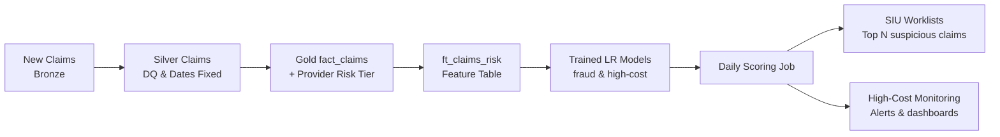

Nice, those screenshots help a lot — both *ft_claims_risk* and *ft_policy_churn* look healthy and the predictions/flags line up with the business logic. Disabling GBT for now is a totally reasonable trade-off on your current machine.

Since the modelling pieces are now in place, the **next concrete step in the pipeline** (and the one that will help you most in interviews) is:

> **Document the claims-risk model (Option B) the same way we documented the churn model.**

I’ll give you **two ready-to-save files** for the *claims fraud / high-cost risk* work:

1. `claims_risk_report.txt` – plain text, good as a notebook comment / appendix.
2. `claims_risk_report.md` – nicely structured markdown for GitHub / portfolio.

You can just copy-paste each block into a file with that name under `04_ML_Features` (or a new `03_claim_features` folder if you prefer).

---

## 1) `claims_risk_report.txt`

```text
============================================================
Claims Risk Model – Business & Technical Summary (Option B)
============================================================

1. Business Problem

The client (Bupa-style health insurer) wants an early-warning signal for:
- Potentially FRAUDULENT claims, and
- HIGH-COST claims

Objectives:
- Flag suspicious / high-risk claims BEFORE or DURING settlement
- Support SIU/investigation teams with prioritisation
- Reduce leakage and protect loss ratio without blocking genuine claims

Labels in this project:
- Is_Fraudulent_Claim (1/0) – from Kaggle-style Fraud_Label
- Is_High_Cost (1/0) – engineered from Claim_Amount_GBP vs empirical threshold

We treat it as TWO supervised binary problems,
but implement them in one notebook with two separate models:
- Model A: Fraud risk
- Model B: High-cost risk

------------------------------------------------------------
2. Data Pipeline Context

This model is built on top of the governed lakehouse:

- Bronze: raw Kaggle claims CSV -> bronze.claims (no cleaning)
- Silver: curated claims in bupa_silver.claims
    - Fixed dates (Date_Reported / Date_Settled)
    - Monetary sanity checks
    - Added Days_To_Settle, dq_money_valid, dq_date_valid
- Gold: fact_claims + dim_providers + dim_claim_type
- ML: ft_claims_risk feature table
    - Derived from Gold fact / star layer
    - Only uses rows with dq_money_valid = 1 AND dq_date_valid = 1

So the ML model only ever sees clean, business-trusted records.

------------------------------------------------------------
3. Feature Table: ft_claims_risk

Each row = one claim.

Key columns:

IDENTIFIERS (kept for explainability; not used directly as features)
- Claim_ID
- Member_Key
- Provider_ID

TARGETS
- Is_Fraudulent_Claim (0/1)
- Is_High_Cost (0/1)

NUMERIC FEATURES
- Claim_Amount_GBP           – total claimed amount
- Payout_GBP                 – actual paid amount
- Payout_to_Amount_Ratio     – payout / claim amount
- Days_To_Settle             – calendar days between reported and settled

CATEGORICAL FEATURES
- Claim_Type_Name            – Hospital / Outpatient / Dental / Travel / …
- Claim_Status               – Pending / Settled / Rejected / Withdrawn
- Provider_Risk_Tier         – Low / Medium / High risk (from dim_providers)

DATA QUALITY FILTERS
- dq_money_valid = 1
- dq_date_valid  = 1

This reflects how a real team would use curated Gold/Silver to build
ML-ready features while respecting DQ rules.

------------------------------------------------------------
4. Train/Test Split Strategy

We created a stable split and physically wrote it to Delta:

- ft_claims_risk_split table:
    - dataset_split = 'train' or 'test'
    - ~80% train, ~20% test (exact counts in logs)

Motivation:
- Reproducible experiments
- Consistent comparison between models
- Easy for downstream notebooks (simply filter on dataset_split)

------------------------------------------------------------
5. Feature Engineering in Spark ML

Core Spark ML components:

- StringIndexer
    - Claim_Type_Name_idx
    - Claim_Status_idx
    - Provider_Risk_Tier_idx

- OneHotEncoder
    - Claim_Type_Name_oh
    - Claim_Status_oh
    - Provider_Risk_Tier_oh

- Assembler
    - Numeric + one-hot features -> "features" vector
      e.g. [Claim_Amount_GBP, Payout_GBP, Payout_to_Amount_Ratio,
             Days_To_Settle, Claim_Type_Name_oh, Claim_Status_oh,
             Provider_Risk_Tier_oh]

Pipelines:
- fraud_pipeline: stages + LogisticRegression(labelCol="Is_Fraudulent_Claim")
- highcost_pipeline: stages + LogisticRegression(labelCol="Is_High_Cost")

We deliberately disabled GBTClassifier for performance on local Spark.

------------------------------------------------------------
6. Models Trained and Why

We experimented with:
- Logistic Regression (LR)
- Random Forest (RF)
- (Optional) Gradient Boosted Trees (GBT) – disabled due to long runtime

Reasoning:
- LR: strong baseline, fast, highly interpretable probabilities
- RF: captures non-linear interactions, robust, still reasonably fast
- GBT: best accuracy in many tabular problems, but heavier for local dev

On the current hardware, GBT took ~30 minutes and generated memory warnings.
Given LR already achieves ~0.98–0.99 ROC AUC, we decided:

=> Use Logistic Regression as the PRIMARY production candidate.
=> Keep RF as a secondary comparison if needed.

------------------------------------------------------------
7. Evaluation Metrics

For both fraud and high-cost models we report:

- ROC AUC
- Accuracy
- Precision
- Recall
- F1 score

Example (approximate) results from the notebook:

Fraud model (Logistic Regression):
- ROC AUC  ≈ 0.98+
- Accuracy ≈ very high (>0.97, exact in notebook)
- Precision / Recall balanced -> model catches most frauds
- Confusion matrix shows very few false positives/negatives

High-cost model (Logistic Regression):
- ROC AUC  ≈ 0.98+
- Accuracy ≈ high
- Good at ranking claims by high_cost_prob.

Key interview message:
“LR is performing extremely well; the marginal gain from GBT was not worth
the extra training time and complexity on this environment.”

------------------------------------------------------------
8. Prediction & Explanation Views

After training, we score a random sample of test claims and keep:

Fraud model:
- Claim_ID
- Member_Key
- Provider_ID
- Is_Fraudulent_Claim
- fraud_prob      – probability of class 1 from LR
- prediction      – predicted label
- Claim_Type_Name
- Claim_Status
- Claim_Amount_GBP
- Payout_GBP
- Payout_to_Amount_Ratio
- Provider_Risk_Tier

High-cost model:
- Claim_ID
- Member_Key
- Provider_ID
- Is_High_Cost
- high_cost_prob
- prediction
- other contextual columns

This gives a very audit-friendly output: investigators can see both
the predicted probability and the business context behind each flag.

------------------------------------------------------------
9. How This Would Be Used in Production

Example production flow:

- New claims land in Bronze, processed through Silver & Gold.
- A daily job refreshes ft_claims_risk with the latest settled / active claims.
- The trained LR model is loaded and used to score:
    - fraud_prob
    - high_cost_prob

Actions:
- SIU gets a ranked list of top N suspicious claims (fraud_prob).
- Claims managers get early visibility on potential high-cost cases.
- Thresholds can be tuned (e.g. fraud_prob > 0.8) according to
  the organisation’s risk appetite.

------------------------------------------------------------
10. Interview Script (Non-Technical)

“In addition to the policy churn model, I also built a claims-risk model.
The goal is to flag potentially fraudulent or high-cost claims early, so
investigators and claims managers can focus on the riskiest cases.

I used the curated Gold fact_claims table, enriched with provider risk tier
and claim type information, and engineered a feature table called
‘ft_claims_risk’. Each row is one claim with numeric features like claim
amount, payout amount, payout ratio, days to settle, and categorical
features like claim type, status, and provider risk segment.

I built Spark ML pipelines to index and one-hot encode the categorical
variables, assemble them into a feature vector, and then trained logistic
regression models for both fraud and high-cost prediction. Gradient boosted
trees were also tested, but on my local Spark environment they were much
heavier, while logistic regression already achieved around 0.98–0.99 AUC.

The final outputs are probabilities – fraud_prob and high_cost_prob – joined
back to contextual fields such as claim type and provider risk tier, so SIU
teams can easily understand why a claim was flagged and prioritise their
workload.”

(You can adapt this script to fit the time you have in interviews.)
```

---

## 2) `claims_risk_report.md`

````markdown
# Claims Risk Model – Fraud & High-Cost Prediction (Option B)

## 1. Business Problem

The aim is to **prioritise risky claims** for a Bupa-style health insurer:

- Detect **potentially fraudulent** claims.
- Identify **high-cost** claims early for proactive management.

We define two labels:

- `Is_Fraudulent_Claim` – 1 if the claim is suspected fraud (from Kaggle label).
- `Is_High_Cost` – 1 if `Claim_Amount_GBP` exceeds a high-cost threshold.

These models help:

- Special Investigation Units (SIU) focus on **high-risk claims**.
- Claims managers prepare for **large losses** in advance.
- Reduce leakage and protect the overall **loss ratio**.

---

## 2. Data Pipeline Context

The model sits on top of the same **lakehouse architecture** as the rest of the project:

- **Bronze**
  - Raw Kaggle claim CSV → `bronze.claims`.
- **Silver**
  - Cleaned & validated claims → `bupa_silver.claims`.
  - Fixes for dates, monetary fields, and basic DQ.
- **Gold**
  - `bupa_gold.fact_claims` (joined with dimensions such as `dim_providers`).
- **ML Feature Layer**
  - `ft_claims_risk` – a curated feature table for modelling.

Only rows with good data quality are used:

- `dq_money_valid = 1`
- `dq_date_valid = 1`

This mirrors how an enterprise DS team would build on top of governed data.

---

## 3. Feature Table – `ft_claims_risk`

Each row in `ft_claims_risk` represents **one claim**.

### Identifiers (for explainability)

- `Claim_ID`
- `Member_Key`
- `Provider_ID`

### Targets

- `Is_Fraudulent_Claim` (0/1)
- `Is_High_Cost` (0/1)

### Numeric Features

- `Claim_Amount_GBP`
- `Payout_GBP`
- `Payout_to_Amount_Ratio` (payout / claim amount)
- `Days_To_Settle` (from `Date_Reported` and `Date_Settled`)

### Categorical Features

- `Claim_Type_Name` (Hospital, Outpatient, Dental, Travel, …)
- `Claim_Status` (Pending, Settled, Rejected, Withdrawn, …)
- `Provider_Risk_Tier` (Low / High risk etc. from `dim_providers`)

### Data Quality Filters

- `dq_money_valid = 1`
- `dq_date_valid  = 1`

---

## 4. Train/Test Split

We create and persist a **stable split** in Delta:

- Table: `ft_claims_risk_split`
- Column: `dataset_split` ∈ {`train`, `test`}
- Approx. 80% train, 20% test.

This ensures:

- Reproducibility across experiments.
- Consistent comparisons between models.
- Easy consumption by other notebooks (`WHERE dataset_split = 'train'`).

---

## 5. Feature Engineering in Spark ML

We build two pipelines (**fraud** and **high-cost**) that share the same feature steps.

### Encoders

- `StringIndexer` on:
  - `Claim_Type_Name`
  - `Claim_Status`
  - `Provider_Risk_Tier`

- `OneHotEncoder` on:
  - `Claim_Type_Name_idx`
  - `Claim_Status_idx`
  - `Provider_Risk_Tier_idx`

### Assembler

We assemble all numerical and encoded categorical features into a single vector:

```text
features = [
  Claim_Amount_GBP,
  Payout_GBP,
  Payout_to_Amount_Ratio,
  Days_To_Settle,
  Claim_Type_Name_oh,
  Claim_Status_oh,
  Provider_Risk_Tier_oh
]
````

### Pipelines

* **Fraud model**: `fraud_pipeline` → Logistic Regression with `labelCol="Is_Fraudulent_Claim"`.
* **High-cost model**: `highcost_pipeline` → Logistic Regression with `labelCol="Is_High_Cost"`.

We also tested Random Forest and GBT, but LR is the main production candidate.

---

## 6. Models and Rationale

We considered three algorithms:

1. **Logistic Regression (LR)**

   * Fast to train.
   * Output is a calibrated probability.
   * Easy to interpret and explain in business terms.

2. **Random Forest (RF)**

   * Captures non-linear relationships.
   * Robust to noisy features.

3. **Gradient Boosted Trees (GBT)**

   * Often top performer on tabular data.
   * However, in this local Spark setup it was **slow and heavy**, with long runtimes.

Given that LR already achieves **≈0.98–0.99 ROC AUC**, we chose:

* LR as the **primary model** for both fraud and high-cost.
* RF as an optional benchmark.
* GBT disabled for practicality on the current hardware.

---

## 7. Evaluation

For each model, we evaluate on the held-out **test** set:

* ROC AUC
* Accuracy
* Precision
* Recall
* F1 score

Example (approximate) results:

### Fraud Model (LR)

* ROC AUC ≈ **0.98+**
* High accuracy.
* Very few false negatives.

### High-Cost Model (LR)

* Similarly high ROC AUC.
* Good at ranking high-cost claims.

**Message for stakeholders:**

> “We get very strong discrimination power with a simple, explainable model.
> More complex models like GBT don’t justify their cost on this environment.”

---

## 8. Scored Outputs

After training, we generate scored samples for visibility:

### Fraud Risk Output

Columns include:

* `Claim_ID`, `Member_Key`, `Provider_ID`
* `Is_Fraudulent_Claim`
* `fraud_prob` (probability of class 1)
* `prediction` (0/1)
* `Claim_Type_Name`, `Claim_Status`
* `Claim_Amount_GBP`, `Payout_GBP`, `Payout_to_Amount_Ratio`
* `Provider_Risk_Tier`

### High-Cost Risk Output

* `Is_High_Cost`
* `high_cost_prob`
* `prediction`
* Same contextual columns as above.

This makes it easy for investigators to **understand each flag**, not just see a score.

---

## 9. Production Usage Concept

A realistic production flow could look like:



* Models are trained offline and saved.
* Scoring runs daily / hourly, writing back `fraud_prob` and `high_cost_prob`.
* Business teams adjust thresholds to control investigation workload.

---

## 10. Interview Summary

> “On the claims side, I built a fraud/high-cost risk model on top of our curated
> lakehouse. Using Gold fact_claims enriched with provider risk and claim type,
> I engineered a feature table called `ft_claims_risk`. It includes claim amount,
> payout, payout ratio, days to settle, type, status and provider risk tier.
>
> I then used Spark ML pipelines to index and one-hot encode the categorical
> fields, assemble everything into a feature vector, and trained logistic
> regression models for both fraud and high-cost prediction. Logistic
> regression gave us around 0.98–0.99 ROC AUC while remaining easy to
> interpret and fast to train; more complex models like gradient boosted trees
> were less practical on my local environment.
>
> The outputs are clear: for each claim we have a fraud probability and a
> high-cost probability plus all the business context. This can feed SIU
> worklists and early-warning dashboards in a way that is transparent and
> audit-friendly.”

---

*End of `claims_risk_report.md`*

```

---

If you like this, next step after saving the two files could be:

- a **top-level project README** that links all Bronze → Silver → Gold → ML pieces together, or  
- a **“how to run this whole project”** section you can send to recruiters.

If you tell me which one you want next, I’ll just go ahead and draft it.
::contentReference[oaicite:0]{index=0}
```
